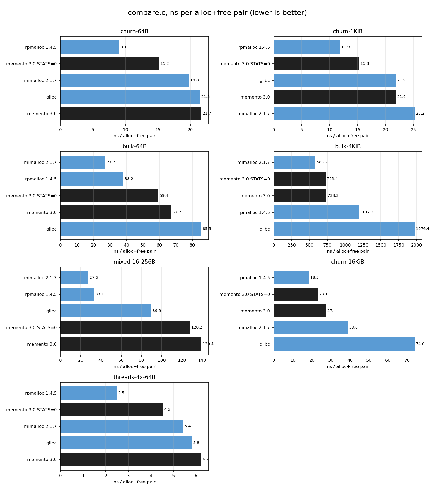
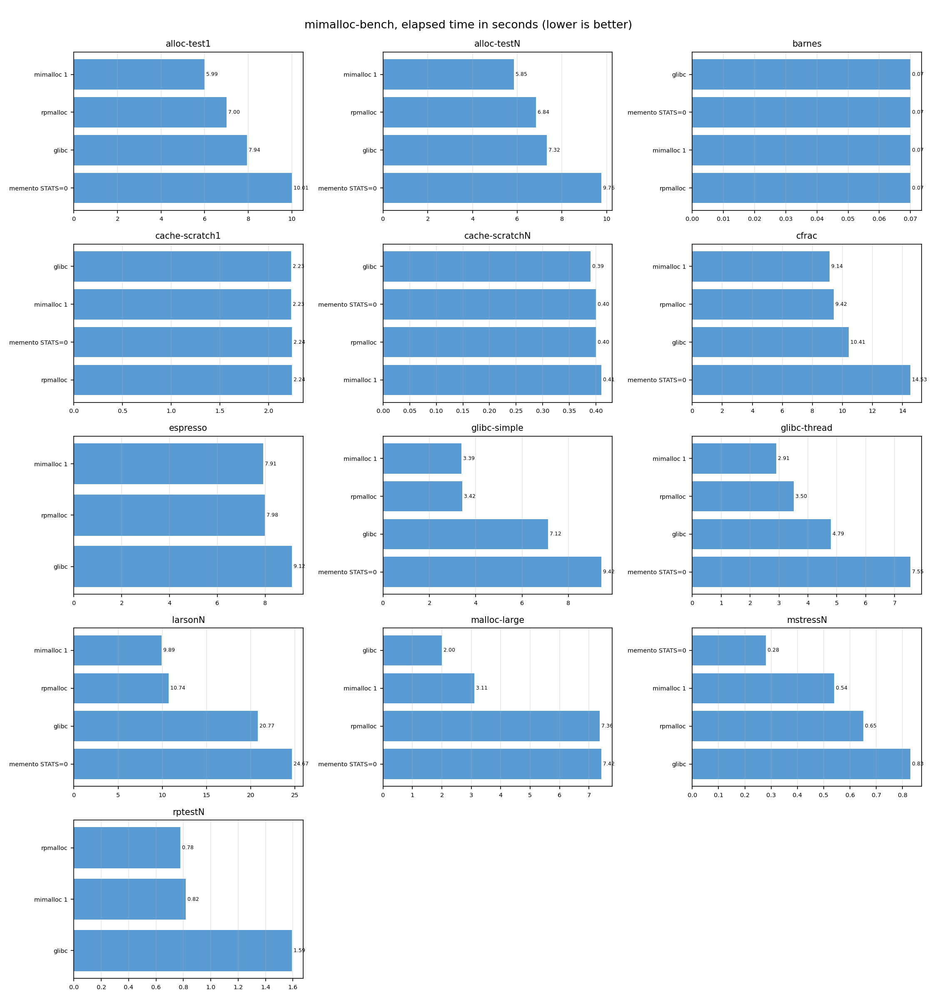
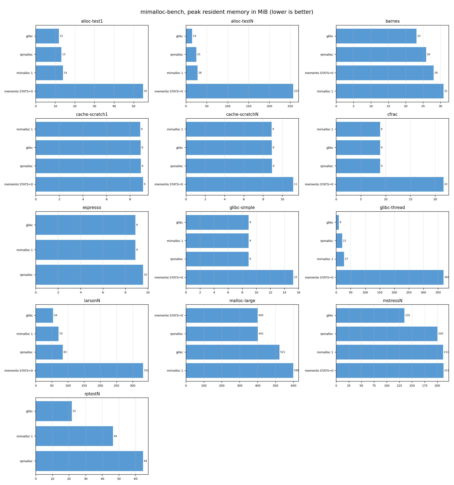

# Benchmarks

Two suites:

1. **`bench/compare.c`** — one binary per allocator, identical workloads,
   min of three runs, ns per alloc+free pair. This is the table in the
   README. Graphs: `bench/images/compare-ns.png`.
2. **[mimalloc-bench](https://github.com/daanx/mimalloc-bench)** — the
   academic/real-program suite rpmalloc publishes (`allt`). Memento is
   wired in as an `LD_PRELOAD` shim via `--external`, the same way you
   would drop `memento_malloc.so` into a production process. Graphs:
   `bench/images/allt-time.png` and `allt-rss.png` (generated when a
   captured CSV is present).

`python3 bench/plot.py` regenerates every graph from `bench/results/*.csv`.
It needs only matplotlib. Allocators more than 4× slower than memento on
a given test are omitted from that chart; the CSVs stay complete.

## Machine

The captured numbers below were collected on:

- NVIDIA Tegra, Cortex-A78AE, 6 cores, aarch64
- 7.4 GiB RAM
- Ubuntu 22.04, kernel 5.15.148-tegra, glibc 2.35
- `cc` is Clang 22.1.3; binaries built `-O3 -march=native -DNDEBUG`
- CPU governor: schedutil (max 1.73 GHz)

Absolute nanoseconds are a function of this 1.7 GHz core. Read the
**ordering**, not the absolute values, against an x86 desktop.

## compare.c (min of 3)



| workload | memento 3.0 | 3.0 `STATS=0` | mimalloc 2.1.7 | rpmalloc 1.4.5 | glibc |
|---|---:|---:|---:|---:|---:|
| churn 64 B | 21.7 | 15.2 | 19.8 | **9.1** | 21.5 |
| churn 1 KiB | 21.9 | 15.3 | 25.3 | **11.9** | 21.9 |
| bulk 64 B | 67.2 | 59.4 | **27.2** | 38.2 | 85.5 |
| bulk 4 KiB | 738 | 725 | **583** | 1188 | 1976 |
| mixed 16–256 B | 139 | 128 | **27.6** | 33.1 | 89.9 |
| churn 16 KiB | 27.4 | 23.1 | 39.0 | **18.5** | 74.0 |
| 4-thread churn 64 B | 6.2 | 4.5 | 5.4 | **2.5** | 5.8 |

How to read it:

- **Hit-path churn.** `STATS=0` is the fair product comparison (the
  default build still carries the counters the diagnostic story wants).
  rpmalloc remains ahead (~9 vs ~15 ns). mimalloc and glibc sit with the
  stats-on build on this core.
- **Mixed sizes** is still the gap: memento is 4–5× the leading pair.
  That row is span occupancy / page-claim, not the tcache hit. Phase 2
  SIMD is compiled in (`-march=native` enables NEON on this chip) and
  was not enough to close it here.
- **Bulk 64 B / 4 KiB.** 2 MiB-aligned VA lets THP actually collapse:
  bulk-4 KiB dropped from ~1.9 µs to 738 ns, next to mimalloc (583) and
  ahead of rpmalloc. bulk-64 B still trails mimalloc/rpmalloc (those two
  keep a hotter unbounded freelist; we recycle at span grain).
- **16 KiB churn** is the page-run cache: memento beats mimalloc and
  glibc, trails rpmalloc.
- **Four threads.** Same shape as single-thread churn, scaled. No
  cross-thread free in this harness (see larson / rptest in the
  mimalloc-bench section for bleeding).

Reproduce:

```
./bench/run_compare.sh          # 3 runs, min, CSV + PNG
python3 bench/plot.py           # regenerate graphs from captured CSV
```

## mimalloc-bench

Memento is not a first-class allocator in upstream mimalloc-bench. The
hook is the one they already ship: `bench.sh --external=<file>` with
`name /path/to.so` per line. `./bench/run_mimalloc_bench.sh` clones the
suite into gitignored `extern/mimalloc-bench`, builds `memento_malloc.so`
plus shared mimalloc/rpmalloc, and runs a subset that does not need
sudo, ninja, redis, lean, or a 5 000-page PDF:

```
./bench/run_mimalloc_bench.sh
# override the test list:
TESTS="cfrac espresso alloc-test rptest" ./bench/run_mimalloc_bench.sh
```

That writes `bench/results/mimalloc-bench-allt.csv` in the
`benchres.csv` layout (`benchmark allocator elapsed rss user sys
page-faults page-reclaims`) and refreshes the allt graphs.

To run the full `allt` set (lean, redis, rocksdb, ghostscript, every
allocator mimalloc-bench knows), use their own builder — it wants
packages and a lot of RAM:

```
cd extern/mimalloc-bench
./build-bench-env.sh all          # sudo, downloads, hours
cd out/bench
../../bench.sh --external=../../bench/results/external.allocs \
    alla allt
cp benchres.csv /path/to/memento/bench/results/mimalloc-bench-allt.csv
python3 /path/to/memento/bench/plot.py
```

`me` is memento, `me0` is `MEMENTO_STATS=0`, `mi` / `rp` / `sys` are
the same three we compare in `compare.c`. Isolated crashes are missing
data points, not zeros; an allocator that fails more than two tests is
dropped from the graphs (rpmalloc's 4× rule, applied in `plot.py`).
A result more than 4× *faster* than the median is also treated as a
crash (the process died before doing the work).

### This machine's subset run




The `LD_PRELOAD` shim (sized malloc, 16-byte header) is a different
API than `compare.c`'s exact `thread_heap_alloc`. On the tests that
completed, `me0` is typically 1.3–2.5× mimalloc/rpmalloc and uses more
RSS — `glibc-thread` in particular (368 MiB vs 9–27 MiB) because parked
spans stay mapped. `malloc-large` matches rpmalloc (both ~7.4 s) and
trails mimalloc.

The shim is **not allt-clean yet**. On this run:

| test | memento (`me` / `me0`) |
|---|---|
| cfrac, alloc-test, glibc-*, cache-scratch, malloc-large | completed |
| larsonN | `me` crashed (no throughput line); `me0` 24.7 s vs mi 9.9 / rp 10.7 |
| espresso | SIGSEGV (`memento_free` of a corrupt/non-sized pointer) |
| mstressN | aborted: "memory corruption at block" (canary) |
| rptestN | aborted (no ops/sec line) |
| barnes | everyone fails here (missing input file) |

`me` failed three tests and is omitted from the graphs; `me0` stays
with two isolated holes. Those sized-path bugs are follow-up, not
hidden by the plot filter — the CSV still has the raw rows.

A VA-bump bug bit the first shim run: `va_bump` aligned the *offset*
into the reservation instead of the resulting address, so spans were
not 2 MiB-aligned, `memento_span_of` AND'd into `PROT_NONE`, and
sized `free` SIGSEGV'd. Exact-API `compare.c` never hit that (it uses
`page_of`). Fixed; `tests/test_sized.c` now asserts a live span header.
